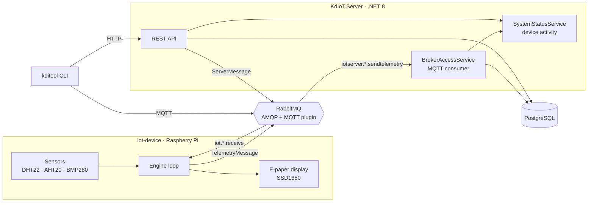

# kd-iot

A self-hosted IoT platform for collecting, storing, and browsing environmental telemetry from DIY sensor devices, with a small e-paper weather station as the reference hardware.

## Overview

The system consists of three independently built components that communicate over MQTT (RabbitMQ) and Protobuf:



| Component | Language | Role |
|---|---|---|
| [`src/KdIoT.Server`](src/KdIoT.Server) | C# / .NET 8 | Backend: consumes telemetry from the broker, persists it, exposes a REST API and Swagger UI |
| [`src/iot-device`](src/iot-device) | Rust | Device firmware: reads sensors, renders readings on e-paper, publishes telemetry, reacts to commands |
| [`src/kditool`](src/kditool) | Rust | CLI client: simulates a device, queries the API, displays results |

## How it works

**Telemetry (device → server).** The device loop samples its sensors on independent timers, aggregates the values into a `ResultTable`, and periodically publishes a Protobuf `TelemetryMessage` to the MQTT topic `iotserver/{device}/sendtelemetry`. RabbitMQ bridges MQTT topics onto its `amq.topic` exchange, where the server's queue bound to `iotserver.*.sendtelemetry` picks the messages up. The server validates that the device id in the routing key matches the payload, auto-registers unknown devices, and stores each reading in PostgreSQL. Every received message also updates a device last-seen table served by the API.

**Commands (server → device).** Sending a request such as `/api/device/air/SendSwitch` publishes a Protobuf `ServerMessage` to `iot/{device}/receive` (or `iot/global` to reach every device at once). Devices subscribe to these topics and react: on the reference device, the command toggles a switch rendered on the e-paper display.

**Shared contract.** All message types (`TelemetryMessage`, `ActivityMesssage`, `ServerMessage`) are defined in `proto_broker_msgs.proto`, which is compiled for C# (Grpc.Tools) and Rust (prost-build) from identical copies in each project.

## MQTT topics

| Topic | Direction | Payload |
|---|---|---|
| `iotserver/{device}/sendtelemetry` | device → server | `TelemetryMessage` |
| `iotserver/{device}/sendactivity` | device → server | `ActivityMesssage` |
| `iot/{device}/receive` | server → device | `ServerMessage` |
| `iot/global` | server → all devices | `ServerMessage` |

Note: the reference firmware currently publishes only telemetry; activity heartbeats are sent by `kditool iotdev`.

## Hardware

The reference device is a Raspberry Pi with:

- **AHT20**: temperature & humidity (I²C)
- **BMP280**: temperature & pressure (I²C)
- **DHT22**: temperature & humidity (read via kernel IIO driver)
- **Waveshare 2.13" e-paper HAT** (SSD1680 controller, SPI): renders averaged temperature/humidity/pressure and the switch state

## Getting started

### Server (Docker)

```bash
cd src/KdIoT.Server
docker compose up
```

This starts RabbitMQ (AMQP `5672`, MQTT `1883`, management UI on `127.0.0.1:15672`), PostgreSQL, and the API itself. The service is then available at:

- API: `http://localhost:8080/api/...`
- Swagger UI: `http://localhost:8080/swagger`

Database migrations are applied automatically on startup. Credentials for the services are configured in the compose file and application code.

### Server (local development)

```bash
cd src/KdIoT.Server
dotnet run
```

The development profile listens on `http://localhost:5185` and expects the `rabbitmq` and `postgres` hosts from the compose file to be reachable.

### Device firmware

Build directly on the Raspberry Pi, or cross-compile for it with [cross](https://github.com/cross-rs/cross) (the `Cross.toml` file installs `protobuf-compiler` in the build container):

```bash
cd src/iot-device
cargo build --release
./target/release/iot-device --id-device air --host-mqqt <broker-host> --port-mqqt 1883
```

Run `iot-device --help` for all options, including MQTT credentials.

### CLI client

```bash
cd src/kditool

# simulate a device: send activity heartbeats and listen for server commands
kditool iotdev --id-device air --hostname <broker-host>

# show when each device was last seen
kditool display-activity --hostname http://<server>:8080

# average measurements for a device in a time range
kditool average-measure --id-device air --hostname http://<server>:8080 \
    --from-date 2024-03-01T00:00:00Z --to-date 2024-03-02T00:00:00Z
```

## API examples

```
GET /api/device/air/LastMeasure                     # latest reading
GET /api/device/air/LastDayMeasures                 # last 24h of readings
GET /api/device/air/LastDayAverageMeasure           # 24h averages
GET /api/device/air/LastAverageMeasure?seconds=600  # averages over a window
GET /api/device/air/AverageMeasureFromToDate?from=...&to=...
GET /api/DeviceActivityTable                        # device → last-seen map
GET /api/device/air/SendSwitch?state=Switch         # command: Switch | Check | Uncheck
GET /api/SendGlobalSwitch?state=Check               # command to all devices
```

## Project structure

```
src/
├── KdIoT.Server/          # ASP.NET Core backend
│   ├── Controllers/       # REST API endpoints
│   ├── Services/          # MQTT broker consumer, device status
│   ├── Data/              # EF Core entities and DbContext
│   ├── Migrations/        # PostgreSQL schema migrations
│   ├── Proto/             # protobuf message contract
│   ├── Dockerfile
│   └── docker-compose.yml # RabbitMQ + PostgreSQL + server
├── iot-device/            # Rust device firmware
│   └── src/engine/        # sensor loop, MQTT connector, e-paper driver
└── kditool/               # Rust CLI client
```

## Tech stack

- **Backend:** .NET 8, ASP.NET Core, Entity Framework Core (Npgsql + NodaTime), RabbitMQ.Client, NSwag, Protobuf
- **Device:** Rust, tokio, rumqttc, prost, rppal (GPIO/I²C/SPI), embedded-hal drivers, embedded-graphics
- **Infrastructure:** Docker Compose, RabbitMQ (AMQP + MQTT plugin), PostgreSQL 16
